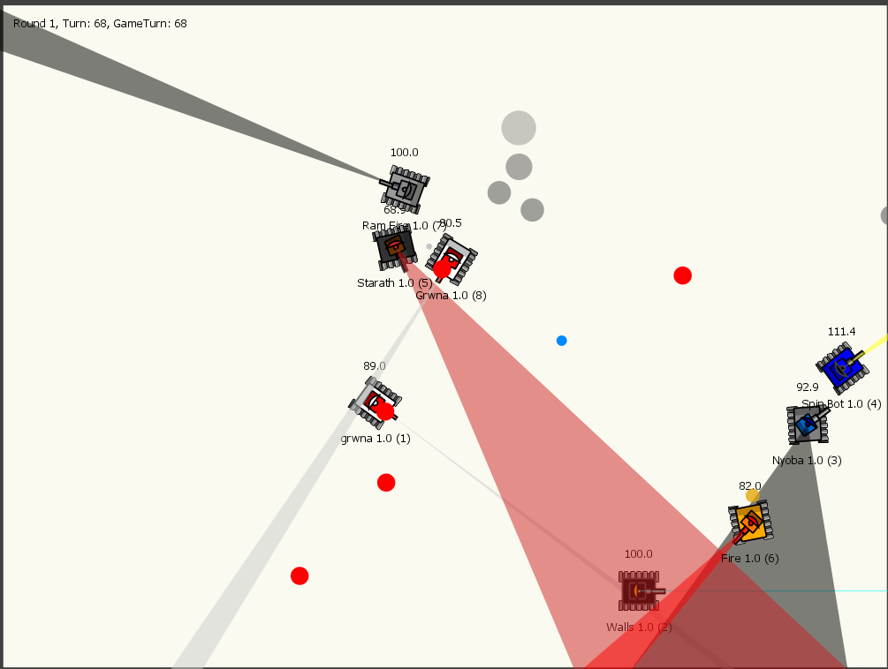
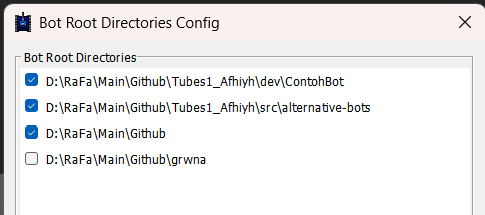
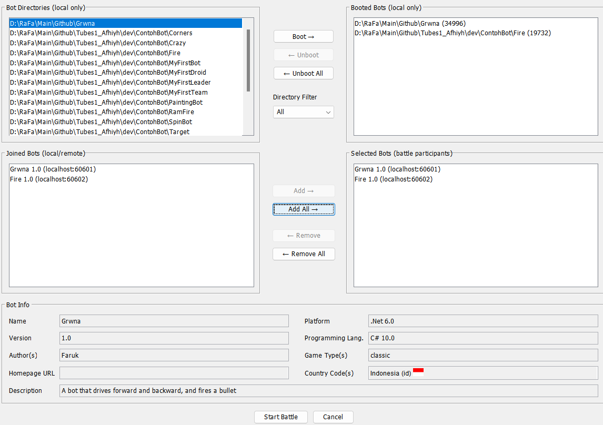

  
 

<H3 align="center">Application of Greedy Algorithms in Robocode : Tugas Besar 1 IF2211 Strategi Algoritma 

 
 

##  Authors: Kelompok 4 - Afhiyh

  

<table border="1" cellspacing="0" cellpadding="8"> 
  <tr> <th>NIM</th> <th>Nama</th> </tr> 
  <tr> <td>13523035</td> <td>M. Rayhan Farrukh</td> </tr> 
  <tr> <td>13523041</td> <td>Hanif Kalyana Aditya</td> 
  </tr> <tr> <td>13523106</td> <td>Athian Nugraha Muarajuang</td> </tr> </table>

  

##  About

<h3 align="center"> Robocode</h3>

  

 
 
Robocode is a programming game where you code Tanks to do certain things, make certain decisions to conquer other Tanks. The goal of the game is to craft the best strategy and code the implementation for that strategy so that your Tank can get the most amount of scores by the end of the game.

 
Greedy Algorithms can be utilized in the creation of strategy for the Tanks. By choosing the best actions at each step, with the intention to obtain a set of best actions by the end of the game, using Greedy Algorithms can lend you the best strategies to win this game.

##  Our Bots
<h3>GrwnaBot</h3>
This bot uses greedy by Bullet Damage and Bonus. It focuses on killing one enemy robot at a time without caring much about defense, instead focusing on defense by offense. The idea is that each successful hit will "heal" the robot by a certain amount corresponding to the damage dealt by the bot. This aggressive behaviour makes this robot very powerful for scoring points.

<h3>KaburBot</h3>
This bot uses Anti-Gravity Movement to isolate itself from the enemies.

<h3>StarathBot</h3>
THis bot uses greedy heuristic of targeting the weakest enemy at any one time. It focuses on Bullet Damage Bonus while not neccessarily focusing on Bullet Damage scores by itself. By targeting the weakest enemy it aims to be the bot that will deliver the last blow killing the enemy.

<h3>HnfadtyaBot</h3>
This bot uses greedy heuristic of targeting the nearest enemy at any one time.

##  Getting Started
<h3>Requirements</h3>
<ul> 
<li> Java: Java SE 8 or later (OpenJDK/Oracle JDK) </li> 
<li> C#: .NET 6.0 or later </li>
<li> Windows or Linux </li>
<li> Robocode GUI </li>
</ul> 

<h3>Compilation and Running</h3>

1. Tulis kode program bot pada bahasa yang didukung seperti Java atau C#.
2. Buka GUI Robocode, lalu masukkan directory dimana kode robot disimpan sebagai salah satu directory sumber robot.

  

3. Tekan menu Start Battle, lalu boot robot-robot yang diinginkan
4. Tambahkan robot-robot yang telah di-boot sebagai robot yang ikut pertarungan
5. Tekan tombol Start Battle dan amati pertempuran para robot!

  

  
 
